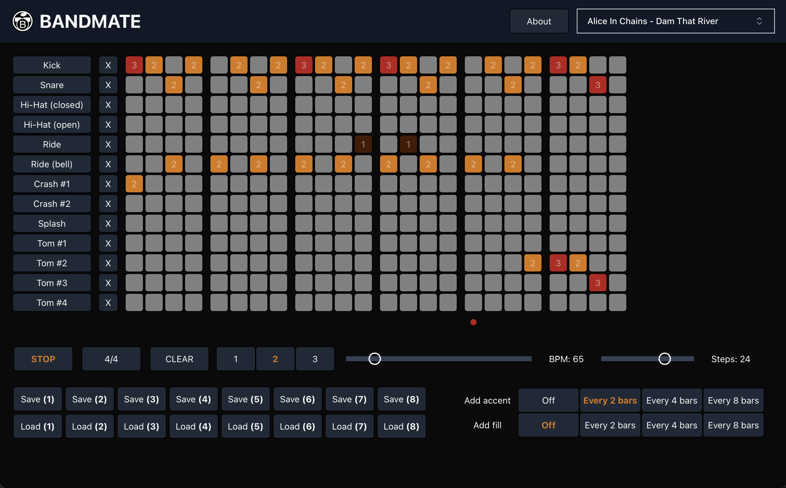

<h2 align="center">🌾&nbsp;&nbsp;&nbsp;Hi! I'm Artem&nbsp;&nbsp;&nbsp;🌾</h2>

I'm a developer based in Amsterdam, Netherlands. I like to build awesome things and I am currently looking for work as a full-stack or backend developer. Get in touch with me at <a href="https://www.linkedin.com/in/artemrasskazimov/">LinkedIn</a>, <a href="https://t.me/sozhran">Telegram</a> or via <a href="mailto:artem.rasskazimov@gmail.com">Gmail</a>.

## Main stack

    

### Other tools I've used

         

<h2 align="center">Projects</h2>

## Bandmate

A drum machine application. Made with [React](https://react.dev) and [TypeScript](https://www.typescriptlang.org/), powered by [Tone.js](https://tonejs.github.io/).

&nbsp;&nbsp;&nbsp;&nbsp;**Live demo:** http://bandmate-drummer.vercel.app

&nbsp;&nbsp;&nbsp;&nbsp;**Code:** http://github.com/sozhran/bandmate

## 2048

My version of a popular game, made with [Svelte](http://svelte.dev) and [TypeScript](https://www.typescriptlang.org/).

&nbsp;&nbsp;&nbsp;&nbsp;**Live demo:** http://2048-sozhran.vercel.app

&nbsp;&nbsp;&nbsp;&nbsp;**Code:** http://github.com/sozhran/2048-svelte

